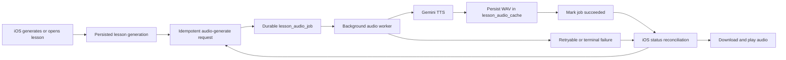

# Plan: Durable Lesson Audio Generation and Recovery

## Status

Implemented on 2026-08-20. The backend now owns hash-bound durable audio jobs and iOS reconciles explicit server audio state with its local cache. The legacy lesson upload and synchronous TTS routes remain temporarily available for already-shipped clients; removal is intentionally gated on the minimum supported app version adopting the durable endpoints.

## Incident That Motivates This Work

For `b1_stage_1_week_2_day_1`, lesson generation succeeded and the generated lesson was persisted, but no `/tts/dialogue` request reached the backend. The current iOS UI then restored the generated lesson without audio and disabled every top control because `isLessonAudioReady` was false. That disabled the menu containing both `Generate Audio` and `Regenerate Lesson`, leaving no recovery action.

The provider was not the cause of this incident. The design allowed an interruption between two client-owned steps to become a permanent UI deadlock:

```text
generate lesson -> persist generated lesson -> generate audio -> save/upload audio
                                      ^ interruption here
```

## Goals

- A persisted generated lesson without audio always has an accessible recovery action.
- Audio generation survives app navigation, suspension, termination, network changes, and client request cancellation.
- Repeated generate/retry requests for the same lesson generation do not create duplicate provider work.
- A stale audio result can never attach to a newly regenerated lesson.
- Server and client expose an explicit, durable audio state rather than inferring it from a local filename and transient Swift booleans.
- Completed and incomplete lessons can both recover missing audio.
- Existing cached audio remains downloadable after app reinstall or local file loss.
- Provider failures are diagnosable without logging lesson text, credentials, or audio bytes.

## Non-goals

- Changing dialogue generation, lesson-interactor behavior, or curriculum prompts.
- Changing the Gemini voices or default TTS model as part of this work.
- Keeping unlimited historical audio. The existing bounded per-user cache policy remains, with pruning made generation-aware.
- The lifecycle-test work covering app termination after lesson generation, termination during TTS, provider timeout, relaunch recovery, and completed lessons missing audio is intentionally excluded from this plan.

## Product Invariants

1. Back navigation is always enabled.
2. The lesson menu is always reachable when generated content exists.
3. Missing or failed audio shows a visible `Retry audio` action next to the audio status.
4. Chat and lesson progression may remain gated until audio is ready, but recovery controls must never share that gate.
5. `Generating audio` is shown only when the server reports a queued or leased job, not merely because audio is absent.
6. A terminal failure becomes `Audio failed` with a retry action and a safe user-facing message.
7. Reopening a lesson reconciles local audio, server audio, and server job state before deciding what the UI should show.
8. Regenerating a lesson creates a new content identity and cannot reuse audio from the prior dialogue.

## Target Architecture



The backend owns asynchronous execution and persistence. The app requests work, observes state, downloads the result, and exposes retry. The backend must not depend on the client remaining connected while Gemini runs.

## Content Identity

Add an immutable generation identity for every generated lesson. Prefer a server-calculated `content_hash` over a client-generated UUID because the backend already receives and stores the generated lesson.

Calculate it from the canonical TTS input derived from parsed Anna/Erik dialogue lines plus the selected TTS model/configuration:

```text
sha256(canonical_tts_text + "\n" + tts_model + "\n" + voice_config_version)
```

Rules:

- Derive TTS text from `generated_lesson_json`; do not accept independent client `tts_text` as authoritative.
- Store the hash on the audio job and cached audio row.
- Every status and audio response includes the hash.
- iOS accepts downloaded audio only when the response hash matches the current generated lesson.
- Regeneration supersedes pending/running jobs for older hashes. A late old result may be retained only as an orphaned diagnostic artifact until cleanup; it must never become current audio.

## Backend Storage

### `lesson_audio_jobs`

Create a durable job table:

- `id`
- `user_id`
- `lesson_id`
- `content_hash`
- `status`: `pending`, `running`, `succeeded`, `failed`, or `superseded`
- `attempt_count`
- `next_attempt_at`
- `lease_expires_at`
- `provider`
- `model`
- `voice_config_version`
- `last_error_code`
- `last_error_summary`: bounded and credential-free
- `created_at`
- `updated_at`
- `completed_at`
- unique key: `(user_id, lesson_id, content_hash)`

Indexes:

- Worker claim: `(status, next_attempt_at, lease_expires_at)`
- User lookup: `(user_id, lesson_id, updated_at DESC)`

The unique key is the idempotency boundary. Concurrent requests return the same active or completed job.

### `lesson_audio_cache`

Extend the existing cache row with:

- `content_hash`
- `job_id`
- `model`
- `voice_config_version`

Make `(user_id, lesson_id, content_hash)` the durable identity. If the table remains one-row-per-lesson, updates must use a compare-and-set against the current generated lesson hash before replacing audio.

Pruning must never remove:

- Audio for an active, incomplete lesson.
- Audio currently referenced by a pending/running job.
- The current generation of the lesson being opened or repaired.

After those protections, retain the five newest generated lesson audios per user as today.

## Backend API

### Request or resume generation

`POST /me/lesson-sessions/{lesson_id}/audio/generate`

Behavior:

1. Authenticate the user and load the stored lesson session.
2. Require valid `generated_lesson_json`.
3. Derive canonical TTS text and `content_hash` server-side.
4. Return existing ready audio metadata if the matching cache row exists.
5. Return the existing pending/running job if one exists.
6. Create or requeue one job otherwise.
7. Return `202 Accepted` for queued/running work and `200 OK` for ready work.

The endpoint accepts no dialogue text, user ID, provider key, or arbitrary model from iOS.

### Read status

`GET /me/lesson-sessions/{lesson_id}/audio/status`

Response fields:

- `lesson_id`
- `content_hash`
- `status`: `missing`, `pending`, `running`, `ready`, or `failed`
- `attempt_count`
- `retryable`
- `updated_at`
- optional bounded `error_code`

Do not expose raw Gemini responses.

### Download audio

Keep `GET /me/lesson-sessions/{lesson_id}/audio`, adding:

- `ETag` based on `content_hash`.
- `X-Lesson-Audio-Content-Hash`.
- Conditional download support.
- A conflict response when the requested/current generation changed while the client was reconciling.

### Explicit retry

The generate endpoint is also the retry endpoint. For a failed job it atomically requeues that same content identity if retry is allowed. Avoid a second endpoint with different semantics.

## Background Worker

Use a durable worker pattern similar to the Evaluator outbox:

1. Claim one due job with a lease.
2. Re-read the current lesson generation and supersede the job if its hash is stale.
3. Call Gemini with the configured timeout.
4. Validate that the result is a non-empty WAV with a RIFF header and is below the size limit.
5. In one transaction, store the matching cache row and mark the job succeeded.
6. On retryable failure, increment attempts and schedule bounded exponential backoff with jitter.
7. On permanent failure or exhausted attempts, mark failed with a safe error code.
8. Expired leases return to pending so a service restart cannot strand work in `running`.

Suggested retry classes:

- Retry: connection errors, timeouts, HTTP 429, and provider 5xx.
- Fail without automatic retry: invalid generated dialogue, invalid provider payload after the configured retry limit, and unsupported configuration.

The user-triggered retry action may requeue a terminal job after configuration or provider conditions change.

## iOS State Model

Replace `isGeneratingAudio` as the source of truth with a small explicit state owned by the lesson/session layer:

```swift
enum LessonAudioAvailability {
    case missing
    case queued
    case generating
    case ready(URL, contentHash: String)
    case failed(retryable: Bool, errorCode: String?)
}
```

A transient task flag may still prevent duplicate button taps, but it must not represent durable job state.

Reconciliation order when opening a generated lesson:

1. Calculate or obtain the expected current content hash.
2. Use matching local audio immediately if it exists.
3. Fetch server audio status.
4. Download matching ready audio if local audio is missing.
5. If status is missing, request generation once.
6. If pending/running, poll with bounded foreground backoff and refresh on app activation.
7. If failed, stop polling and show retry.

Polling stops when the view disappears, but server work continues. Reopening or app activation resumes status reconciliation rather than starting duplicate work.

## iOS UX Changes

### Top controls

- Back: always enabled.
- Menu: enabled whenever generated content exists.
- Dialogue/practice panels: may remain disabled until audio is ready if that is the product requirement.

Do not use one `areLessonControlsEnabled` value for navigation, recovery, content panels, and chat. Give each control category its own capability.

### Inline audio panel

- `missing`: `Audio unavailable` plus `Generate audio`.
- `queued` or `generating`: spinner, status text, and Back remains enabled.
- `failed`: `Audio couldn’t be generated` plus `Retry audio`.
- `ready`: existing playback controls.

### Menu

- `Regenerate Lesson` remains reachable for missing or failed audio.
- `Generate/Retry Audio` remains reachable for the current generated dialogue.
- Disable only the action already in flight; do not disable the entire menu.

### Automatic recovery guardrails

- Automatically request generation once when a generated lesson opens with neither local nor server audio.
- Do not loop automatic retries after a server-reported failure.
- Require a user tap after the automatic retry budget is exhausted.
- Coalesce concurrent view, activation, and sync triggers into one reconciliation task per lesson.

## Session Sync and Regeneration Semantics

- Add current audio status and `content_hash` to lesson-session responses or fetch it through the status endpoint during reconciliation.
- Treat local `audio_file_name` as a cache reference, not authoritative server state.
- Clear a local filename when the file is absent or its recorded hash does not match.
- When `reset_generation` replaces generated content, atomically supersede old audio jobs and detach old cached audio from the session.
- Do not delete the previous audio blob until the new generation is committed; cleanup can occur afterward.
- A completed lesson is allowed to generate or restore audio. Completion must not block repair.
- Server conflict recovery must preserve the current audio hash exactly as it preserves the opaque `server_updated_at` token.

## Observability

Emit one structured event per transition:

- `lesson_audio_requested`
- `lesson_audio_job_claimed`
- `lesson_audio_provider_succeeded`
- `lesson_audio_retry_scheduled`
- `lesson_audio_failed`
- `lesson_audio_superseded`
- `lesson_audio_downloaded`

Fields:

- user ID
- lesson ID
- content-hash prefix
- job ID
- attempt number
- model and voice-config version
- elapsed milliseconds
- result byte count for success
- safe error class/code

Never log dialogue text, request URLs containing API keys, raw provider bodies, audio bytes, Apple identifiers, or email addresses in normal request logs.

Add operational metrics for pending/running/failed job counts, age of the oldest pending job, success latency, retry rate, terminal failure rate, and lessons with generated content but neither matching audio nor an active job.

Alert on:

- Running leases that repeatedly expire.
- Old pending jobs beyond the expected generation window.
- A sustained terminal failure rate.
- Any generated lesson that remains without audio and without a recoverable job.

## Migration and Backfill

1. Add the jobs table and audio-cache hash metadata without changing current API behavior.
2. Derive and backfill content hashes for existing generated lessons and cached audio where the association is unambiguous.
3. Mark ambiguous legacy audio for lazy regeneration rather than guessing.
4. Deploy the worker disabled and validate migrations/diagnostics.
5. Enable job creation for new audio requests while retaining the old synchronous endpoint as a temporary compatibility path.
6. Ship the iOS recovery UI and status reconciliation.
7. Enable automatic missing-audio enqueueing.
8. Remove the legacy client-supplied `/tts/dialogue` lesson path after the minimum supported app version uses durable jobs. The custom TTS feature may keep a separate synchronous endpoint because it has no lesson identity.
9. Run a one-time backfill that enqueues jobs for generated lessons missing audio, bounded by recency and active-user criteria to control provider cost.

## Security and Cost Controls

- All job APIs remain authenticated and user-scoped.
- Derive dialogue and model configuration server-side.
- Rate-limit explicit retries per user and content hash.
- Coalesce duplicate requests through the unique job key.
- Cap attempts, input length, output size, and total queued jobs per user.
- Record provider/model usage for audio cost accounting without recording content.

## Implementation Sequence

### Phase 1: Remove the UI deadlock

- Split navigation/menu capability from audio/chat capability in `LessonView.swift`.
- Add inline Generate/Retry Audio UI.
- Keep `Regenerate Lesson` accessible without audio.
- Improve missing, generating, failed, and ready copy.

This phase should ship quickly because it fixes recovery even before the durable backend is complete.

### Phase 2: Durable backend jobs

- Add database migration and job repository methods in `backend/app/db.py`.
- Add request/status API contracts in `backend/app/models.py` and routes in `backend/app/main.py`.
- Add the leased audio worker and provider-result validation.
- Extend cached audio with content identity.
- Add structured logging and metrics.

### Phase 3: iOS reconciliation

- Add BackendClient request/status methods.
- Move audio availability/reconciliation into `LessonSessionStore` or a dedicated audio coordinator.
- Make `LessonDetailView` render the explicit state.
- Adopt ETag/hash-aware download and reject stale audio.
- Remove lesson dependence on the synchronous `/tts/dialogue` response.

### Phase 4: Operations and cleanup

- Backfill current missing-audio sessions within the chosen recency limits.
- Retire the legacy lesson TTS route after client adoption.
- Update `docs/RUNBOOK.md` with worker status, repair, and verification commands.

## Verification

Verification for this implementation should cover deterministic state, API, storage, and worker behavior while respecting the explicit lifecycle-test exclusion above:

- Database migration and rollback on a production-shaped SQLite copy.
- Idempotent create/retry behavior under concurrent API requests.
- Lease expiry and worker re-claim behavior.
- Retry classification and maximum-attempt enforcement.
- Content-hash mismatch and stale-result rejection.
- Regeneration superseding an older pending/running job.
- WAV validation, size limits, and cache pruning protections.
- Authentication, cross-user isolation, rate limits, and safe error responses.
- iOS build and existing backend test suite.
- Live VM smoke check using a non-production lesson/user fixture, followed by service health and structured-log inspection.

## Acceptance Criteria

- No restored lesson state can disable Back, Menu, and all audio recovery actions simultaneously.
- A generated lesson missing audio automatically obtains or requests one durable job.
- Killing or disconnecting the client cannot cancel backend-owned audio work.
- Repeated requests for one generation resolve to one job and one current cache entry.
- Regeneration cannot attach an old WAV to new dialogue.
- Provider failure becomes an observable failed state with bounded automatic retry and user-triggered retry.
- Completed lessons can restore or regenerate missing audio.
- Logs and metrics identify where every audio request stopped without exposing protected content.
- The old synchronous lesson-audio path is removed after supported clients migrate.
