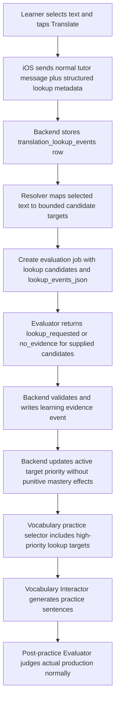

# Plan: Manual Translation Lookups as Vocabulary Signals

## Status

Implemented locally on 2026-06-26. This document describes the architecture for turning user-initiated text-selection translation into vocabulary-practice prioritization while preserving the bounded Evaluator design.

## Problem

The iOS app now lets the learner select visible text and ask for a translation. Today that action becomes a normal chat message such as:

```text
Please translate läget.
```

That gives the learner an immediate answer, but it loses the structured learning signal. From the learner's perspective, asking to translate a word or phrase often means: "I did not know this, please bring it back later." The current vocabulary-practice selector cannot reliably use that signal because it cannot distinguish a manual translate action from ordinary chat.

At the same time, the current Evaluator architecture is intentionally bounded: it evaluates supplied candidate targets and does not freely discover arbitrary vocabulary from the whole transcript. That structure is valuable for continuity, validation, and predictable practice selection.

## Goals

- Make manual translation lookups influence future vocabulary practice.
- Keep lookup signals separate from wrong-answer evidence.
- Preserve the Evaluator's bounded candidate model.
- Prioritize common, useful unknown words and chunks higher than obscure one-off words.
- Handle whole-sentence selections conservatively, without activating every word in the sentence.
- Keep iOS APIs free of hidden target IDs and mastery notes where possible.

## Non-goals

- Build a full Swedish morphological parser.
- Infer every unknown word from every chat message.
- Treat a lookup as a failed production attempt.
- Show learner-facing mastery scores or hidden Evaluator reasons.
- Guarantee perfect sense disambiguation for every Swedish word.

## Core Decision

Manual translate actions should flow through the same durable evaluation/evidence pipeline, but with a new non-punitive signal type.

Do not force lookup events into the existing `demonstrated`, `partial`, `struggled`, or `no_evidence` rubric. A lookup request means the learner signaled uncertainty or curiosity. It is not proof that they failed to produce the target.

Add a first-class Evaluator result type such as:

```json
{
  "target_kind": "vocabulary",
  "target_key": "vocabulary:expression:läget",
  "outcome": "lookup_requested",
  "evidence_strength": "lookup",
  "confidence": 0.91,
  "evidence_lookup_ids": ["lookup_12"],
  "reason": "The learner manually requested a translation for a common colloquial expression."
}
```

`lookup_requested` should activate or prioritize practice, but it must not:

- count as an independent production failure;
- increment `struggle_count`;
- reset a production success streak;
- resolve or demonstrate mastery.

## Proposed Flow



## iOS Event Shape

Keep the current learner-facing behavior: selecting text still sends a message to the tutor so the learner gets an immediate translation in chat.

Additionally, send structured metadata with that request:

```json
{
  "action": "translate_selection",
  "selected_text": "Hur är läget idag?",
  "source_kind": "lesson",
  "source_id": "b2_stage_1_week_1_day_1",
  "source_surface": "generated_dialogue",
  "surrounding_text": "Anna: Hur är läget idag? Erik: Det är ganska bra.",
  "visible_course_level": "B2",
  "created_at": "2026-06-26T12:00:00Z"
}
```

`source_surface` should be best effort and may include values such as:

- `generated_dialogue`
- `assistant_message`
- `user_message`
- `lesson_panel`
- `vocabulary_practice_message`
- `vocabulary_question`

The backend should trust the authenticated user and source ownership, but not trust target IDs from iOS. The backend derives target candidates server-side.

## Storage

Add `translation_lookup_events`.

Suggested fields:

- `id`
- `user_id`
- `source_kind`: `lesson` or `vocabulary_practice`
- `source_id`
- `source_surface`
- `selected_text`
- `normalized_text`
- `surrounding_text`
- `status`: `pending`, `evaluated`, `ignored`, `failed`
- `created_at`
- `evaluated_at`

Optional later fields:

- `language_guess`
- `resolution_json`
- `last_error`

This table stores the user action. Learning-state changes still happen through `learning_evidence_events` and `user_learning_targets`.

## Candidate Resolution

The resolver is deterministic backend code that turns one lookup event into a small candidate list for the Evaluator. It is not the Evaluator's job to scan arbitrary text and invent targets.

### Exact Short Selection

If the selected text is a short word or phrase:

1. Normalize it with the existing vocabulary normalization.
2. Exact-match against catalog vocabulary target keys.
3. Prefer expression matches over word matches when both exist.
4. If no catalog target exists, optionally create an ad hoc lookup vocabulary target.

Example:

```text
Selected: läget
Candidate: vocabulary:expression:läget
```

### Whole-Sentence Selection

A whole-sentence lookup means "some part of this sentence was unclear", not "every contained word is weak."

For sentence selections:

1. Store the exact selected sentence.
2. Find exact known useful chunks inside the sentence.
3. Find exact known expression targets inside the sentence.
4. Find known word targets inside the sentence.
5. Remove very basic filler and already-resolved targets unless repeated.
6. Rank candidates by usefulness and confidence.
7. Send only the top 1-3 candidates to the Evaluator.

Example:

```text
Selected: Hur är läget idag?
Candidates:
- vocabulary:expression:hur är läget?
- vocabulary:expression:läget
- vocabulary:word:idag
```

Likely outcome:

- `hur är läget?` or `läget`: `lookup_requested`, high priority if common and not mastered.
- `idag`: `no_evidence` or low-priority lookup if already basic/known.

### Ad Hoc Lookup Targets

Some looked-up words may not exist in `Materials/Vocabulary`. For those, create a user-scoped or catalog-like ad hoc target only when the text is plausible Swedish and not too long.

Suggested target shape:

```json
{
  "target_kind": "vocabulary",
  "target_key": "vocabulary:lookup:vibrera",
  "display_text": "vibrera",
  "target_subtype": "lookup_word",
  "source_level": "lookup",
  "description": "Manual translation lookup"
}
```

Ad hoc targets should start with lower priority unless repeated or judged common by the ranking heuristic. This prevents rare words like `vibrera` from crowding out core vocabulary.

## Priority Scoring

Do not ask the Evaluator to compute final scheduling priority. Let the Evaluator classify the evidence signal; deterministic backend code computes priority.

Suggested priority inputs:

- base signal: manual lookup adds practice interest;
- commonness: common/core items receive a large boost;
- curriculum relevance: current or completed-stage vocabulary receives a boost;
- repeated lookup count: repeated lookups increase priority;
- source surface: generated dialogue and assistant explanation lookups are stronger than menu/help text;
- selection ambiguity: whole-sentence selections reduce confidence and priority for individual tokens;
- recent practice cooldown: recently practiced targets are delayed unless high priority;
- resolved status: resolved targets require stronger lookup/repetition to reactivate;
- obscurity: rare/ad hoc/domain-specific words receive low priority.

Initial scoring can be simple:

```text
priority_delta =
  lookup_base
  + commonness_boost
  + curriculum_relevance_boost
  + repeated_lookup_boost
  - sentence_ambiguity_penalty
  - recent_practice_penalty
  - obscurity_penalty
```

Suggested behavior:

- common expression looked up directly: high priority;
- common expression inside a looked-up sentence: medium-high priority;
- known but low-frequency curriculum word: medium priority;
- ad hoc rare word: low priority;
- repeated ad hoc word: medium priority.

## Commonness Heuristic

Start without an external frequency dependency.

Use a lightweight internal heuristic:

- catalog occurrence count across `Materials/Vocabulary`;
- source level: B1 targets are treated as more foundational than late B2 targets;
- target subtype: useful chunks and active expressions can outrank isolated words;
- current progression proximity;
- optional small curated override list for very common Swedish words/chunks.

Later, this can be improved with a Swedish frequency list, but it is not required for the first implementation.

## Evaluator Input Contract

For lookup evaluation jobs, send:

1. normal shared course foundation;
2. Evaluator prompt;
3. evaluation metadata with `source_kind`;
4. bounded candidate target catalog;
5. current user state for those candidates;
6. `lookup_events_json`;
7. optional source context and surrounding text.

Example snapshot:

```json
{
  "evaluation_version": "v2",
  "source_kind": "translation_lookup",
  "source_id": "lookup_batch_123",
  "candidates": [
    {
      "target_kind": "vocabulary",
      "target_key": "vocabulary:expression:läget",
      "display_text": "läget",
      "target_subtype": "expression",
      "source_level": "B1"
    }
  ],
  "lookup_events": [
    {
      "lookup_id": "lookup_12",
      "selected_text": "läget",
      "source_kind": "lesson",
      "source_id": "b2_stage_1_week_1_day_1",
      "source_surface": "generated_dialogue",
      "surrounding_text": "Hur är läget idag?"
    }
  ]
}
```

Prompt rule:

```text
A manual translation lookup is evidence that the learner requested help with the selected text.
It is not evidence of independent production failure.
Use lookup_requested only for supplied vocabulary candidates that are plausibly the selected unknown word, expression, or chunk.
For whole-sentence selections, be conservative: do not mark every word as lookup_requested.
Use no_evidence when the selected span does not reliably indicate uncertainty about the candidate.
```

## Evaluator Schema Changes

Use the shared Evaluator schema `v2`, not a separate lookup-specific Evaluator. Normal lesson and vocabulary-practice evaluations keep their existing semantics under the same role, while `translation_lookup` jobs may use the new lookup-only outcome.

Add:

- outcome: `lookup_requested`
- evidence strength: `lookup`
- evidence references: `evidence_lookup_ids`

Validation requirements:

- `lookup_requested` is allowed only for vocabulary targets.
- `lookup_requested` must use `evidence_strength = lookup`.
- `lookup_requested` must reference supplied lookup IDs, not turn IDs.
- normal `demonstrated`, `partial`, and `struggled` still require normal turn evidence.
- `lookup_requested` does not count as production evidence.

## Mastery State Semantics

When applying `lookup_requested`:

- create or keep `user_learning_targets.status = active`;
- increase priority according to backend scoring;
- increment a lookup-specific counter if added;
- write a `learning_evidence_events` row;
- do not increment `struggle_count`;
- do not reset `success_streak`;
- do not mark resolved;
- do not count toward the two-demonstration resolution rule.

If a resolved target is looked up:

- reactivate only when the lookup is high-confidence and useful, or repeated;
- otherwise write evidence but leave it resolved with a small priority bump or no scheduling effect.

## Vocabulary Practice Selection

Extend practice target selection to consider lookup-derived active vocabulary.

Recommended slot policy:

- keep five questions total;
- keep grammar included as today when available;
- reserve 2 vocabulary slots for lookup-derived targets by default when enough lookup targets are active;
- allow 3 lookup-derived vocabulary slots when the third target is high-priority because it is common, repeated, or strongly curriculum-relevant;
- high-priority lookup targets may outrank ordinary weak targets;
- low-priority ad hoc lookup targets should appear only when there is room or repetition.

The selector should pass lookup context to the Vocabulary Interactor, for example:

```json
{
  "target_key": "vocabulary:expression:läget",
  "display_text": "läget",
  "priority_reason": "Manual translation lookup of a common colloquial expression.",
  "lookup_context": "Hur är läget idag?",
  "selection_origin": "manual_translation_lookup"
}
```

This helps the generated English sentence naturally elicit the target instead of using it in an unrelated or awkward way.

## Interaction With Vocabulary Consistency Plan

This plan complements `docs/next_step/vocabulary_consistency_bead.md`.

When lookup-derived targets enter practice, the generated practice should still use backend-only grading contracts. Lookup context should become part of the selected target metadata and should be available when generating the question contract.

For example, a lookup of `läget` should generate a practice sentence that naturally elicits the colloquial usage, not just any sentence containing `läge`.

## Efficient Implementation Sequence

### Phase 1: Structured Event Capture

- Add backend request shape for translate-selection metadata.
- Store `translation_lookup_events`.
- Continue sending the normal chat message for immediate tutor response.
- Add tests that iOS cannot supply target IDs and that lookup rows are user-scoped.

### Phase 2: Resolver and Lookup Evaluation Jobs

- Add deterministic resolver for exact word/phrase matches.
- Add conservative sentence resolver with top 1-3 candidates.
- Add `translation_lookup` evaluation jobs.
- Add Evaluator schema/prompt support for `lookup_requested`.
- Validate that unknown candidate IDs and unknown lookup IDs are rejected.

### Phase 3: Learning-State Application

- Apply `lookup_requested` as non-punitive active-target evidence.
- Add priority scoring constants and tests.
- Ensure lookup evidence does not affect production success streaks or struggle counts.

### Phase 4: Vocabulary Practice Selection

- Include lookup targets in selection with 2 default lookup-driven vocabulary slots and a 3-slot cap for high-priority lookup targets.
- Add cooldown and low-priority behavior for obscure/ad hoc items.
- Pass lookup context into Vocabulary Interactor input.
- Add tests for common looked-up item vs obscure looked-up item selection order.

### Phase 5: Whole-Sentence Tuning

- Add fixtures for sentence selections with one unknown chunk, two unknown words, and mostly-known text.
- Verify only plausible top candidates receive `lookup_requested`.
- Add curated commonness overrides if internal catalog frequency is insufficient.

## Implementation Decisions

- `lookup_requested` lives in the shared Evaluator schema `v2`.
- Ad hoc lookup targets use normal vocabulary target keys and are stored through `user_learning_targets` when Evaluator evidence is applied.
- Lookup-derived vocabulary selection uses 2 default lookup-driven slots and a 3-slot cap for high-priority lookup targets.
- The first implementation uses internal commonness heuristics based on catalog occurrence count, source level, target subtype, and selection ambiguity. No external Swedish frequency list is required.
- Ad hoc lookup targets are bounded to short word/phrase selections.

## Acceptance Criteria

- Selecting and translating `läget` creates a durable lookup event.
- The backend, not iOS, resolves `läget` to a bounded vocabulary candidate.
- Evaluator can return `lookup_requested` only for supplied vocabulary candidates and supplied lookup IDs.
- A `lookup_requested` result activates or prioritizes practice without counting as a failed production attempt.
- A common looked-up expression appears in future vocabulary practice before low-priority obscure lookup words.
- Whole-sentence lookup does not activate every contained word.
- Post-practice Evaluator still judges actual learner production with the existing mastery semantics.
