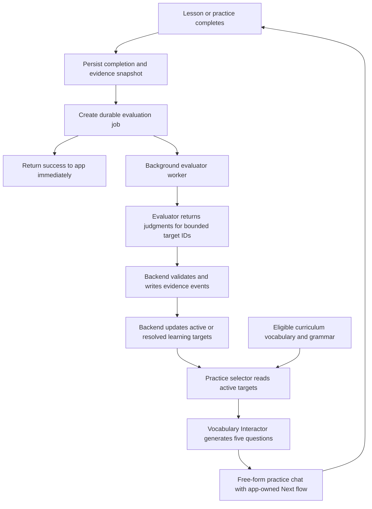

# Plan: Vocabulary Practice v1

## Status

Implemented locally on 2026-06-21. Backend and iOS automated tests pass; live VM/model verification remains the deployment step. This document remains the v1 architecture and acceptance contract.

## Product Decisions

- Add a top-level `Vocabulary` tab.
- The tab starts with a `Generate practice` button and a list of previous practice chats.
- A practice contains exactly five English-to-Swedish translation questions.
- Practice is also a free-form tutor chat. The learner can ask questions before or after answering the active translation question.
- The app owns question progression. A `Next` button advances after the active question has received an assessed answer.
- The practice chat uses the existing lesson-chat visual language.
- Its top controls are only `Back`, `Question list`, and `Menu`.
- It has no dialogue panel and no audio player.
- Each practice should combine vocabulary and grammar, with vocabulary receiving most of the emphasis.
- Curriculum candidates may come only from completed lessons and the learner's current lesson. Future lessons are excluded.
- The Evaluator runs after a normal lesson or vocabulary practice becomes complete.
- Completion is never blocked by evaluation. Failed evaluations are retried silently.
- A manually completed lesson with no meaningful learner evidence is recorded as complete but is not sent to the model.
- A weak target normally needs two successful demonstrations in separate completed sessions before leaving active repetition.
- Resolved targets retain their history and can be reactivated by later evidence.
- Saved vocabulary is outside v1.

## v1 Boundaries

### Included

- Post-completion evaluation of normal lessons.
- Post-completion evaluation of five-question vocabulary practices.
- Durable, user-scoped weak-target storage for vocabulary and grammar.
- Selection of active weak targets plus eligible curriculum fallback targets.
- Free-form chat within a practice.
- Practice history and resume support for unfinished practices.
- Silent, durable evaluation retries.

### Not included

- User-saved vocabulary.
- Spaced-repetition scheduling or due dates.
- Flashcards, multiple choice, speech assessment, or audio.
- A separate vocabulary-dialogue generator.
- User-visible mastery scores or evaluator notes.
- Cross-user analytics or recommendations.
- Multiple specialized evaluators.
- Continuing a completed practice chat. Completed chats are viewable but read-only in v1; a new practice creates a new evidence boundary.

## Core Architecture



There is one Evaluator role and one Vocabulary Interactor role in v1. A separate Vocabulary Generator is unnecessary: the Vocabulary Interactor generates the five-question quiz only when a new practice is created, then handles answer feedback and free-form questions in the same stored session.

## Source of Truth

### Curriculum content

- Vocabulary comes from:
  - `Materials/Vocabulary/B1/B1_Vocabulary.json`
  - `Materials/Vocabulary/B2/B2_Vocabulary.json`
- Grammar candidates come from the per-lesson `grammar_target` sections under `Materials/Lessons/`.
- Lesson IDs and `absolute_day` connect both catalogs to learner progression.
- The backend loads and indexes these files. The iOS client does not send the complete vocabulary catalog to OpenAI.

### User-specific state

User-specific evaluator state belongs in backend SQLite, not in a JSON file. A document per user would make indexed retrieval, concurrent updates, idempotency, and recovery unnecessarily difficult.

The model does not directly insert, delete, or score database rows. It returns evidence judgments. Deterministic backend code applies the state transition.

## Stable Target Identity

The current vocabulary files contain strings but no item IDs. At load time, the backend should derive a stable `target_key` from:

- target kind: `vocabulary` or `grammar`
- vocabulary subtype: `word` or `expression`
- normalized Swedish text, or canonical grammar code

Normalization for vocabulary v1:

1. Unicode-normalize.
2. Trim outer whitespace.
3. Collapse repeated inner whitespace.
4. Case-fold for identity while preserving original display text.
5. Keep words and expressions as different subtypes.

The same normalized item can have many lesson occurrences. Do not create a separate mastery target for every lesson occurrence. Homonym/sense splitting is deferred because the current curriculum does not encode senses.

Grammar codes should be deterministic slugs derived from curriculum grammar names and reviewed for collisions. The Evaluator may judge only grammar codes supplied in its candidate list.

## Storage Model

The migration-3 vocabulary and grammar tables have no active code paths and do not cleanly represent this loop. The live VM check on 2026-06-21 confirmed zero rows in all five legacy mastery tables. They remain unused; do not mix the two mastery systems.

### `user_learning_targets`

One current-state row for a user and target:

- `id`
- `user_id`
- `target_kind`: `vocabulary` or `grammar`
- `target_key`
- `display_text`
- `target_subtype`: `word`, `expression`, or a grammar category
- `status`: `active` or `resolved`
- `priority_score`
- `success_streak`
- `struggle_count`
- `evidence_count`
- `source_level`
- `first_seen_at`
- `last_evaluated_at`
- `resolved_at`
- unique key: `(user_id, target_kind, target_key)`

Required retrieval index:

```text
(user_id, status, priority_score DESC, last_evaluated_at ASC)
```

Only targets with actual struggle/partial evidence need a current-state row. Correct use of an otherwise untracked curriculum item can remain only in the evaluation record; v1 does not need a complete mastery row for every curriculum word.

### `learning_evidence_events`

Append-only evidence behind state changes:

- `id`
- `user_id`
- `learning_target_id`
- `evaluation_job_id`
- `source_kind`: `lesson` or `vocabulary_practice`
- `source_id`
- `outcome`: `struggled`, `partial`, or `demonstrated`
- `evidence_strength`: `production`, `recognition`, or `assisted_production`
- `confidence`
- `evidence_json`: bounded turn IDs and a short reason
- `created_at`
- unique key: `(evaluation_job_id, learning_target_id)`

### `evaluation_jobs`

A durable outbox and audit record:

- `id`
- `user_id`
- `source_kind`
- `source_id`
- `input_hash`
- `input_snapshot_json`
- `status`: `pending`, `running`, `succeeded`, `skipped_no_evidence`, or `failed`
- `attempt_count`
- `next_attempt_at`
- `lease_expires_at`
- `prompt_version`
- `model`
- `raw_output_json`
- `last_error`
- `created_at`
- `completed_at`
- unique key: `(user_id, source_kind, source_id, input_hash)`

The input snapshot prevents a later lesson reset or practice edit from changing evidence that was already queued.

### `vocabulary_practice_sessions`

One backend-owned row per generated practice:

- `id`: UUID
- `user_id`
- `course_level`
- `stage_number`
- `progress_cutoff_absolute_day`
- `status`: `generating`, `active`, `completed`, `abandoned`, or `failed`
- `selection_snapshot_json`
- `quiz_json`
- `state_json`
- `messages_json`
- `created_at`
- `updated_at`
- `completed_at`

For v1, JSON columns are appropriate for five questions and one bounded chat. Summary fields remain relational so the history list is efficient.

## Mastery State Transition

Evaluator judgments are evidence, not direct truth.

### On `struggled`

- Create or reactivate the target.
- Set `status = active`.
- Reset `success_streak` to zero.
- Increase `priority_score`.
- Increment struggle and evidence counts.

### On `partial`

- Create or keep the target active.
- Reset `success_streak` to zero.
- Keep a medium priority.
- Increment evidence count.

### On `demonstrated`

- Count it toward resolution only when:
  - confidence meets the configured threshold;
  - evidence is independent learner production, not recognition alone;
  - the source is a different completed lesson/practice from the previous successful demonstration.
- Increment `success_streak` and reduce priority.
- At two qualifying demonstrations, set `status = resolved` and record `resolved_at`.

### Later regression

Any later `struggled` or strong `partial` result reactivates a resolved target and resets its success streak.

The numerical priority adjustments and confidence threshold should be named backend constants with unit tests. They should not live only in the prompt.

## Evaluator Input Selection

The Evaluator must not receive the user's entire learning history on every run.

### Normal lesson candidates

- All vocabulary targets authored for that lesson.
- Eligible curriculum vocabulary found by exact normalized matching in the generated dialogue or learner turns.
- The lesson's main grammar target.
- A bounded set of its supporting grammar targets.
- Existing active user targets that occur in or are directly relevant to the lesson evidence.

### Vocabulary-practice candidates

- Exactly the vocabulary and grammar target IDs attached to the five generated questions.
- Current user state for those targets.

### Evidence threshold

Skip the model call and mark the job `skipped_no_evidence` when there is no meaningful learner evidence. Examples:

- A lesson or week was manually marked complete without learner answers.
- A generated lesson has no learner turns or translation attempts.
- A practice never received an assessed answer.

Assistant text alone is not learner evidence.

## Shared Prompt Layer

Every model role receives the same role-neutral course foundation first:

1. `Materials/Shared_base_prompt.md`
2. The role-specific prompt

This applies to Generator, lesson Interactor, Vocabulary Interactor, and Evaluator.

`Shared_base_prompt.md` is role-neutral. It contains only shared operating context: course purpose, curriculum conventions, level context, pedagogical principles, and boundaries common to every role. It does not tell the model to chat, correct the learner, generate a dialogue, evaluate mastery, advance state, or use a particular output shape.

Move each behavioral instruction into the applicable role prompt:

- `Generator_prompt.md`
- `Interactor_prompt.md`
- `Vocabulary_interactor_prompt.md`
- `Evaluator_prompt.md`

The current Generator and lesson Interactor retain their lesson-specific behavior in their own prompts. This gives Evaluator and Vocabulary Interactor the same course context without assigning them behavior from another role.

## Evaluator Prompt Contract

Prompt stack, in order:

1. `Materials/Shared_base_prompt.md`
2. `Materials/Evaluator_prompt.md`

The prompt should answer one narrow question:

> For each supplied candidate target, what does this completed session demonstrate about the learner's current ability?

### Stable input order

1. Stable shared course foundation followed by Evaluator instructions and rubric.
2. Evaluation metadata and schema version.
3. Candidate target catalog with stable IDs.
4. Current user state only for those candidates.
5. Source context: lesson or vocabulary practice.
6. Generated dialogue/questions or practice quiz.
7. Turn-numbered learner evidence and relevant assistant context.

The transcript should preserve whether help was given before an answer. The Evaluator must independently assess the evidence and must not treat Vocabulary Interactor feedback as authoritative.

### Strict output

Use Responses API Structured Outputs with a strict JSON schema:

```json
{
  "evaluation_version": "v1",
  "results": [
    {
      "target_kind": "vocabulary",
      "target_key": "vocabulary:expression:...",
      "outcome": "struggled",
      "evidence_strength": "production",
      "confidence": 0.91,
      "evidence_turn_ids": ["turn_12"],
      "reason": "Short evidence-based reason"
    }
  ]
}
```

Allowed outcome for a candidate with insufficient evidence is `no_evidence`. The backend discards `no_evidence` from mastery updates.

Validation rules:

- Reject unknown target IDs.
- Reject evidence turn IDs absent from the snapshot.
- Reject confidence outside `0...1`.
- Limit one result per target.
- Cap reason length.
- Do not accept model-proposed mastery scores or database actions.

## Durable Evaluation Execution

When a session transitions from incomplete to complete:

1. Persist completion.
2. Build and store the immutable evaluation snapshot in the same database transaction.
3. Return completion success to the client.
4. Let a small backend worker claim pending jobs.
5. Call Evaluator and apply validated evidence atomically.
6. Retry transient failures with bounded exponential backoff.

The single-VM FastAPI service can run the worker from application lifespan for v1. Job leasing prevents duplicate processing after restart. Idempotency comes from the input hash plus unique evidence constraints.

Permanent failure remains internal and does not reverse lesson/practice completion. A later deployment or admin repair can retry failed jobs.

## Practice Target Selection

Selection is deterministic backend logic; it is not delegated entirely to the model.

### Progress cutoff

- Determine the learner's current lesson as the first incomplete lesson in curriculum order.
- Eligible fallback curriculum content is from completed lessons plus that current lesson.
- Never use later lessons.
- Active unresolved targets from earlier levels remain eligible because they explicitly need repetition.
- A manually completed future lesson must not advance the cutoff past an earlier incomplete lesson.

### Selection priority

1. High-priority active weak vocabulary.
2. High-priority active weak grammar.
3. Recent eligible vocabulary from the current stage.
4. Recent eligible grammar from the current lesson/stage.
5. Older eligible curriculum fallback if necessary.

Aim for three or four vocabulary targets and one or two grammar targets across the five sentences. One sentence may exercise multiple targets. Prefer variety and avoid repeating the exact same target from the last two practices when equivalent alternatives exist, unless its priority remains high.

Resolved targets are excluded from normal selection. They return only if later lesson evidence reactivates them.

The selected candidate list is stored before generation so the practice remains reproducible and auditable.

## Vocabulary Interactor

Prompt stack, in order:

1. `Materials/Shared_base_prompt.md`
2. `Materials/Vocabulary_interactor_prompt.md`

This uses the same shared-course-then-role layering as Generator, lesson Interactor, and Evaluator.

### Responsibilities

- Generate exactly five English translation questions when a new practice is created.
- Use only supplied target IDs and eligible context.
- Produce natural, level-appropriate English sentences whose Swedish translations exercise the selected targets.
- Evaluate the learner's Swedish answer to the active question.
- Correct grammar, vocabulary, word order, and idiomatic usage.
- Answer free-form vocabulary, grammar, translation, and usage questions.
- Account for help already given in the chat.
- Never advance question state or mark practice complete.

### Quiz-generation output

Each stored question needs hidden target attribution:

```json
{
  "questions": [
    {
      "id": "q1",
      "sentence_en": "...",
      "target_keys": ["vocabulary:expression:...", "grammar:..." ]
    }
  ],
  "opening_text": "..."
}
```

Backend validation requires exactly five questions, unique IDs, non-empty English sentences, and only selected target keys. The target mappings are stored server-side and later become the Evaluator's bounded candidates.

### Message output

```json
{
  "assistant_text": "...",
  "turn_kind": "answer_feedback",
  "answer_assessment": "partial",
  "active_question_answered": true
}
```

Rules:

- `turn_kind` is `answer_feedback` or `free_form_chat`.
- `answer_assessment` is `correct`, `partial`, `incorrect`, or `not_an_answer`.
- `active_question_answered` controls whether Next becomes available.
- A clarification question does not count as an answer.
- An answer given after substantial hints may be assessed for immediate feedback, but the Evaluator sees the assistance and can classify it as assisted production.
- The backend validates the response; the app does not trust arbitrary state mutations from the model.

### Input order for chat turns

1. Stable shared course foundation followed by the Vocabulary Interactor prompt.
2. Course and progression context.
3. Selected target definitions.
4. Full five-question quiz metadata.
5. Prior practice chat history.
6. Active question only.
7. Practice state.
8. Latest learner message.

As in the lesson interactor, keep stable sections first for prompt-cache reuse. Use strict structured output for both quiz generation and message responses. See the official [Structured Outputs](https://developers.openai.com/api/docs/guides/structured-outputs) and [prompt caching](https://developers.openai.com/api/docs/guides/prompt-caching) guides.

## Practice State Machine

```text
generating -> active(q1) -> active(q2) -> ... -> active(q5) -> completed
                    ^ free-form chat may occur at every active question ^
```

For each question:

1. Show the English sentence in chat and in `Question list`.
2. Accept free-form messages.
3. Vocabulary Interactor indicates whether a message was an assessed answer.
4. Enable Next after at least one assessed answer for the active question.
5. Next advances locally/server-side without asking the model to choose progression.
6. Next after question five marks the practice complete and enqueues evaluation.

The app should continue allowing free-form questions after an answer and before Next. Only one active question is sent as the active target on each chat turn.

## Backend API

Suggested authenticated endpoints:

### Practice history

- `GET /me/vocabulary-practices`
  - returns summary rows ordered newest first
- `GET /me/vocabulary-practices/{practice_id}`
  - returns full stored practice, state, quiz, and messages

### Practice lifecycle

- `POST /me/vocabulary-practices`
  - derives progression and target selection server-side
  - generates and persists the five-question quiz
- `POST /me/vocabulary-practices/{practice_id}/messages`
  - appends one learner message and one structured tutor response
- `POST /me/vocabulary-practices/{practice_id}/next`
  - advances only when the active question has an assessed answer
  - completes and queues evaluation after question five

The client never supplies `user_id`, model name, target keys, mastery scores, or progression cutoff. Those are derived or configured by the backend.

Normal lesson evaluation is triggered inside the existing lesson-session completion transition; it does not require a public evaluate endpoint.

## iOS UX

### Vocabulary tab home

- Add `Vocabulary` to the root `TabView`.
- Top primary action: `Generate practice`.
- While generating, disable duplicate taps and show progress.
- Below it, show previous practices newest first.
- History row minimum content:
  - date/time
  - level and stage
  - `In progress` or `Completed`
- Tapping an in-progress practice resumes it.
- Tapping a completed practice opens a read-only transcript and question list.

### Practice chat

Reuse/refactor the lesson chat's shared visual components instead of copying the whole lesson view.

Top controls:

1. `Back`
2. `Question list`
3. `Menu`

`Question list` displays all five English questions, the active question, and answered markers. It must not display hidden target IDs or evaluator state.

There is no `Where we are`, `Dialog`, audio player, or lesson-specific menu action.

Minimal v1 menu:

- `End practice` for an unfinished session, with confirmation.

Ending early marks the session abandoned/inactive but does not evaluate it unless all five questions have assessed answers. A later version can add restart, delete, saved vocabulary, or alternative practice modes.

The bottom input and Next behavior should match lesson chat. Next is disabled until the active question has been assessed.

## Model and Cost Configuration

- Configure Evaluator and Vocabulary Interactor model IDs and reasoning effort on the backend.
- Do not accept model choice from iOS for these endpoints.
- Start model selection with a small fixture bake-off rather than assuming the largest model is required.
- Candidate baseline:
  - Evaluator: `gpt-5.4-mini`, low reasoning.
  - Vocabulary Interactor: current lesson-interactor model, low reasoning, then compare against `gpt-5.4-mini`.
- Use versioned prompts and record model/prompt versions per evaluation and practice.
- Extend existing `openai_response_usage` logging with `request_name`, evaluation/practice ID, and prompt version, without logging learner text.
- Use organization cost endpoints from `docs/BILLING.md` for actual dollar validation rather than token-price estimates.

## Prompt Fixtures Before Rollout

### Evaluator fixtures

- Strong independent use of a target word.
- Incorrect vocabulary followed by tutor correction.
- Correct answer only after a direct hint.
- Grammar error repeated across several turns.
- Previously weak target demonstrated correctly in a later lesson.
- Previously weak target demonstrated in two separate practices and resolved.
- Resolved target later used incorrectly and reactivated.
- Manual completion with no learner evidence.
- Learner asks about a word but never produces it.

### Vocabulary Interactor fixtures

- Five valid questions from mixed vocabulary and grammar targets.
- Free-form question before an answer.
- Free-form question after an answer but before Next.
- Incorrect, partial, correct, and natural-but-different translations.
- Learner writes English instead of Swedish.
- Learner answers two sentences at once.
- Attempt to make the model advance state.
- Attempt to introduce an unselected/future curriculum target.

Compare candidate models on target adherence, Swedish correction quality, false mastery, false struggle, structured-output validity, latency, and billed cost.

## Backend Tests

- Completion transition creates exactly one evaluation job.
- Repeated session sync is idempotent.
- Manual completion without evidence creates no model call.
- Worker retry survives process restart.
- Job leasing prevents duplicate concurrent evaluation.
- Unknown Evaluator target IDs are rejected.
- Evidence and state update commit atomically.
- Two qualifying demonstrations from different sessions resolve a target.
- Two demonstrations from the same session do not resolve it.
- Later struggle reactivates a resolved target.
- User A cannot read or update user B's practices or learning targets.
- Selector never includes curriculum after the progression cutoff.
- Selector may include unresolved targets from an earlier level.
- Quiz generation stores exactly five questions with valid target IDs.
- Next cannot advance before an assessed answer.
- Final Next completes once and queues one evaluation.

## iOS Tests

- Vocabulary tab shows Generate and history.
- Generate creates one practice despite repeated taps.
- In-progress history row resumes the correct question.
- Completed history row is read-only.
- Top control bar has exactly Back, Question list, and Menu.
- Question list reflects active/answered state.
- Free-form chat does not incorrectly enable Next.
- Assessed answer enables Next.
- Final Next shows completion even while evaluation remains pending.
- Evaluation failure is not shown as practice failure.

## Implementation Sequence

### Phase 1: Catalog and persistence

1. Add backend vocabulary/grammar catalog loaders and deterministic target keys.
2. Add the new SQLite migration and repository methods.
3. Confirm/deprecate the unused migration-3 mastery tables.
4. Add state-transition unit tests.

### Phase 2: Evaluator loop

The role-neutral shared foundation and preservation of current Generator/lesson-Interactor behavior are already complete.

1. Add `Materials/Evaluator_prompt.md` and strict schema.
2. Build bounded lesson/practice evidence snapshots.
3. Enqueue jobs on completion transitions.
4. Add durable worker, validation, retry, and idempotent application.
5. Run evaluator fixtures before connecting results to practice selection.

### Phase 3: Vocabulary-practice backend

1. Add deterministic candidate selection.
2. Add `Materials/Vocabulary_interactor_prompt.md` and strict schemas on top of the shared course foundation.
3. Add practice lifecycle endpoints and storage.
4. Add free-form chat and app-owned Next validation.
5. Add backend contract/security tests.

### Phase 4: iOS tab and chat

1. Extract reusable chat/control components from `LessonView.swift`.
2. Add Vocabulary tab home and history.
3. Add practice chat with three top controls and no audio/dialogue UI.
4. Add resume, completed read-only view, loading, empty, and error states.
5. Build and test on simulator and `iPhone_D` where useful.

### Phase 5: Live verification

1. Deploy backend migration and code.
2. Complete a lesson and verify silent evaluation.
3. Generate practice and inspect target attribution.
4. Complete practice and verify mastery updates.
5. Demonstrate one target in a second session and verify resolution.
6. Verify origin, local, and VM remain synchronized.

## Acceptance Criteria

- Completing a normal lesson with meaningful learner evidence queues evaluation exactly once.
- Completing a vocabulary practice queues evaluation exactly once.
- Evaluation never blocks completion and survives transient failures.
- Evaluator output is restricted to supplied target IDs and validated evidence.
- Active weak vocabulary and grammar are efficiently retrievable per user.
- Two qualifying successes in separate sessions resolve an active target.
- Later struggle reactivates a resolved target.
- Generated practice contains exactly five eligible translation questions.
- Practice prioritizes vocabulary while including grammar.
- Future curriculum content is never selected.
- Practice supports free-form chat and app-owned Next progression.
- Vocabulary tab shows Generate and previous practice chats.
- Practice chat has only Back, Question list, and Menu at the top, with no dialogue audio UI.
